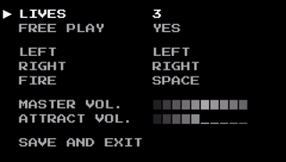

## Example

Create a class that holds the configuration items:

```C#
    public class DemoConfiguration
    {
        [Configuration("Lives", new Object[] { 3, 4, 5 })]
        [Order(0)] public int Lives { get; set; } = 3;

        [Configuration("Free Play", new Object[] { "Yes", "No" })]
        [Order(10)] public string FreePlay { get; set; } = "Yes";       

        [Spacer]
        [ConfigurationKey("Left")]
        [Order(20)] public Keys LeftKey { get; set; } = Keys.Left;

        [ConfigurationKey("Right")]
        [Order(30)] public Keys RightKey { get; set; } = Keys.Right;

        [ConfigurationKey("Fire")]
        [Order(40)] public Keys FireKey { get; set; } = Keys.Space;

        [Spacer]
        [ConfigurationSlider("Master Vol.")]
        [Order(50)] public int MasterVolume { get; set; } = 10;

        [ConfigurationSlider("Attract Vol.")]
        [Order(60)] public int AttractVolume { get; set; } = 5;               
    }
```

Create the menu in the Game class:

```C#      
    //Create a menu for DemoConfiguration
    SettingsMenu<DemoConfiguration> menu = new SettingsMenu<DemoConfiguration>(this, myConfiguration);
    menu.MenuCloseEvent += Menu_MenuCloseEvent;        
    Components.Add(menu);                       
```

Check out the Demo project for more examples:

